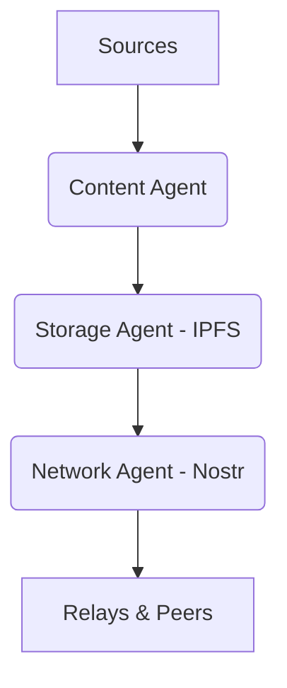

# Podcast Generator

> **Note:** This project is now part of the [AgentMesh](../../README.md) ecosystem as the reference application for decentralized architecture.

An automatic pipeline that transforms newsletters into podcast episodes in **Italian**, ready for listening.

## Quick Start

```bash
uv sync
playwright install firefox
cp .env.example .env
# Edit .env with your GEMINI_API_KEY and newsletter source
```

### CLI
```bash
python main.py daily
```

### Web App
```bash
uvicorn podcast_generator.web.app:app --reload
```

## v3.0 Architecture (AgentMesh)

PodcastGen utilizes AgentMesh agents to manage the workflow:

- **Content Agent:** Handles scraping and AI synthesis.
- **Storage Agent:** Handles distributed storage on **IPFS**.
- **Network Agent:** Handles identity and communication via **Nostr**.



## Documentation

- [Web App Usage Guide](../../docs/web-app.md)
- [Python Library Usage Guide](../../docs/library.md)
- [Roadmap v3.0](../../docs/ROADMAP.md)
