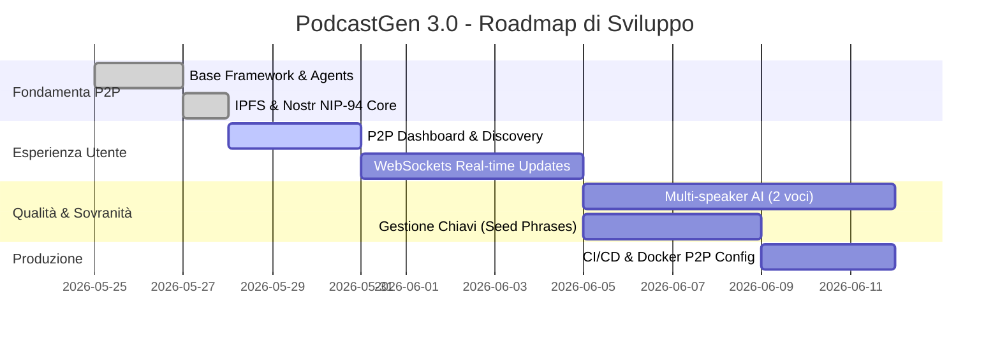
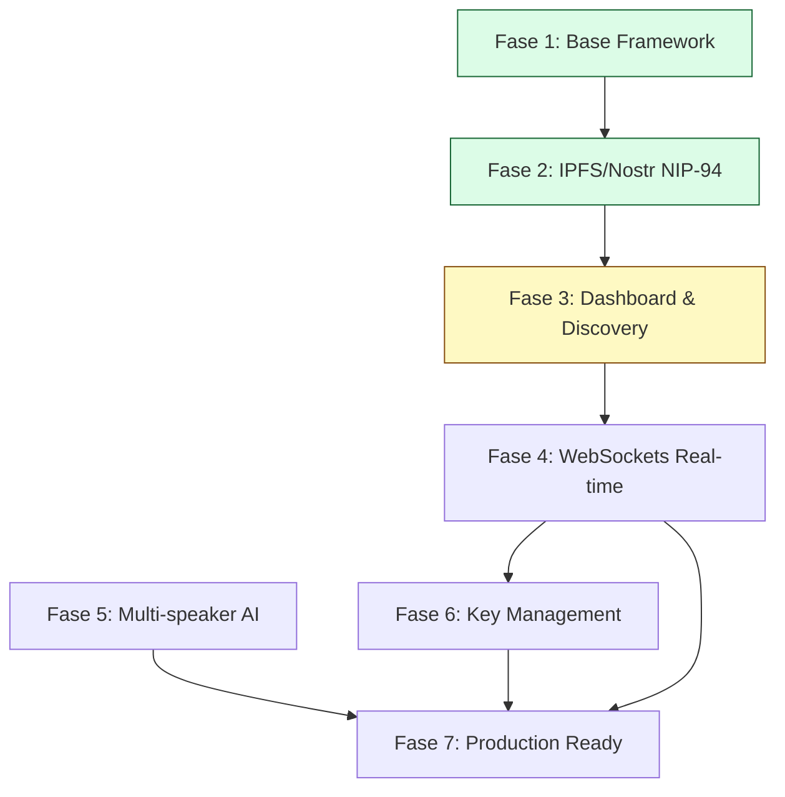
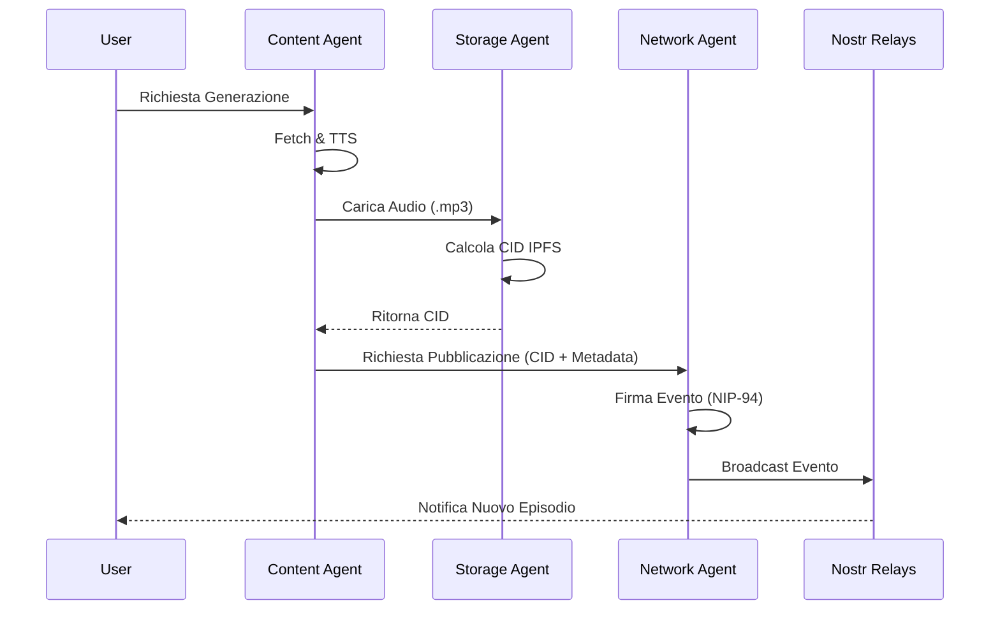

# Roadmap Tecnica PodcastGen 3.0

## 1. Analisi e Stato Avanzamento
PodcastGen 3.0 trasforma un tool monolitico in una flotta di agenti P2P coordinati.

### Milestone Raggiunte (✅)
- **BaseAgent Framework:** Implementata l'interfaccia asincrona per tutti gli agenti.
- **StorageAgent (IPFS):** Integrazione con Pinata e nodi locali per storage immutabile.
- **NetworkAgent (Nostr):** Gestione identità crittografica e pubblicazione NIP-94.
- **SocialAgent (Discovery):** Scansione dei relay Nostr per feed globali.
- **AgentsManager:** Hub centrale per il lifecycle degli agenti nella Web App.

---

## 2. Diagramma di Progetto (Gantt & PERT)

### Cronologia Sviluppo (Gantt)

### Relazioni e Dipendenze (Diagramma PERT)

---

## 3. Dettaglio Fasi Future

### Fase 4: Interazione Real-time (WebSockets)
- **Obiettivo:** Notificare l'utente di nuovi podcast scoperti su Nostr in tempo reale.
- **Tasks:** Implementazione `SocialAgent` listener su relay, integrazione FastAPI WebSockets.
- **Stima:** 5 giorni.

### Fase 5: Qualità Audio Avanzata (Multi-speaker)
- **Obiettivo:** Trasformare il monologo in una conversazione tra due host AI.
- **Tasks:** LLM Prompting per script a due voci, orchestrazione TTS con voci multiple (Giuseppe & Elsa).
- **Stima:** 7 giorni.

### Fase 6: Sovranità Totale (Key Management)
- **Obiettivo:** Permettere all'utente di importare la propria chiave Nostr esistente.
- **Tasks:** Pagina Impostazioni per export/import Seed Phrase (NIP-06).
- **Stima:** 4 giorni.

---

## 4. Specifiche Tecniche del Protocollo P2P (Dettaglio)

### Flusso di Pubblicazione (Sequence Diagram)

### Protocolli e NIP Adottati
*   **Identità:** NIP-01 (Basic protocol flow) e NIP-19 (Bech32-encoded keys/events).
*   **Metadata File:** **NIP-94 (File Metadata)**. Questo permette ai client Nostr di riconoscere l'evento come un file multimediale scaricabile.
*   **Discovery:** NIP-02 (Contact List) per seguire altri creatori di podcast.
