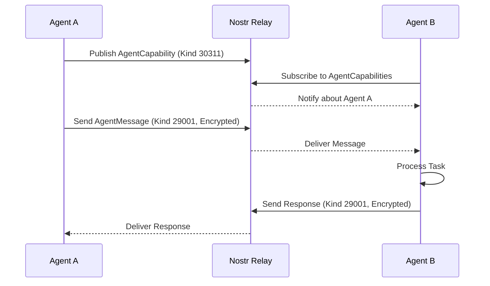

# AgentMesh Core

The `agentmesh-core` package provides the foundational interfaces and models for the AgentMesh ecosystem.

## Features

- **Standardized Models**: Pydantic models for `AgentCapability`, `AgentMessage`, and `AgentReputation`.
- **Base Interfaces**: Abstract base classes for Agents, LLM Providers, and Knowledge Bases.
- **Orchestration**: Logic for managing multi-agent workflows and project-level coordination.
- **Economic Protocols**: Framework for handling payments and task-based incentives.
- **Observability**: Structured JSON logging for distributed systems.

## A2A Communication Flow



## Core Models

### AgentMessage
The primary way agents communicate in the mesh.
```python
from agentmesh.core.models import AgentMessage

msg = AgentMessage(
    sender="npub1...",
    type="task",
    payload={"action": "calculate", "value": 42}
)
```

## Structure

- `agentmesh.core.base`: Base classes for all agents.
- `agentmesh.core.models`: Data structures for mesh communication.
- `agentmesh.core.interfaces`: Specialized interfaces for plugins.
- `agentmesh.core.workflow`: Workflow management and execution.
- `agentmesh.core.logging`: Structured logging utilities.
